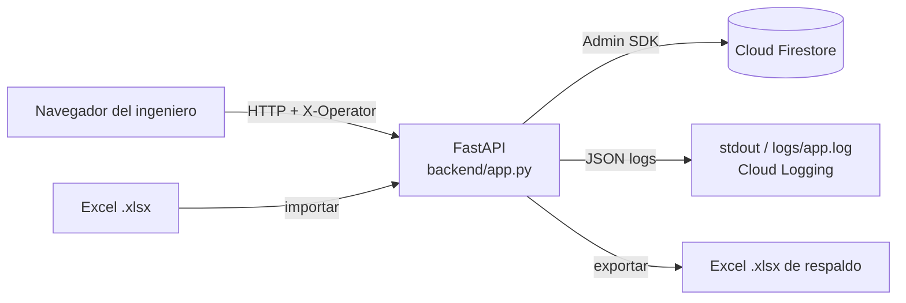

# Claro CENAM Service Manager

Aplicación web para administrar el inventario de direcciones IP de Claro CENAM en **Cloud Firestore (Firebase)**, reservar y liberar IPs por servicio y generar el formato técnico de alta (Internet Corporativo, Datos y Acceso Empresarial), con **trazabilidad completa**: cada operación tiene un ID único que aparece en pantalla, en los logs y en la bitácora de Firestore.

> Este README es la **guía técnica de despliegue**. Para el uso diario consulte el [Manual de usuario](docs/MANUAL_USUARIO.md) y para mantener el código el [Manual de desarrollador](docs/MANUAL_DESARROLLADOR.md).

---

## Contenido

1. [Arquitectura](#1-arquitectura)
2. [Requisitos](#2-requisitos)
3. [Preparar Firebase](#3-preparar-firebase)
4. [Variables de entorno](#4-variables-de-entorno)
5. [Opciones de despliegue](#5-opciones-de-despliegue)
6. [Carga inicial de datos](#6-carga-inicial-de-datos)
7. [Verificación posterior al despliegue](#7-verificación-posterior-al-despliegue)
8. [Logs, trazabilidad y soporte](#8-logs-trazabilidad-y-soporte)
9. [Respaldo y recuperación](#9-respaldo-y-recuperación)
10. [Actualización y reversión](#10-actualización-y-reversión)
11. [Seguridad](#11-seguridad)
12. [Solución de problemas](#12-solución-de-problemas)
13. [Migración desde la versión 1 (Excel)](#13-migración-desde-la-versión-1-excel)

---

## 1. Arquitectura



* **Backend:** Python 3.11+ con FastAPI. Sirve también el frontend estático (`frontend/`).
* **Datos:** Cloud Firestore. La colección `ip_addresses` **sustituye al Excel**; el Excel solo se usa para importar y exportar.
* **Altas:** cada alta registrada crea un documento en la colección `altas`.
* **Auditoría:** cada operación de escritura (y todo error) crea un documento en `operations` con su ID único.
* **Sin inicio de sesión:** el usuario escribe su nombre al entrar y se registra en cada operación. Vea [Seguridad](#11-seguridad).

| Colección | Contenido |
|---|---|
| `inventory_sheets` | Resumen por segmento /24 (equivale a una pestaña del Excel) |
| `ip_segments` | Subredes: red, gateway, broadcast, VLAN y contadores |
| `ip_addresses` | Una IP por documento: `DISPONIBLE`, `OCUPADA` o `GATEWAY` |
| `inventory_imports` | Bitácora de importaciones de Excel |
| `altas` | Formatos de alta registrados (texto completo y datos del formulario, sin la PSK) |
| `alta_hashes` | Garantiza que un mismo texto de alta no se registre dos veces |
| `operations` | Auditoría por ID de operación (con `expires_at` para TTL) |
| `centrales` | Catálogo de centrales y rutas de equipos |

---

## 2. Requisitos

| Componente | Versión / detalle |
|---|---|
| Python | 3.11 o superior (probado con 3.12 y 3.13) |
| Proyecto Firebase | Con Cloud Firestore en modo nativo |
| Cuenta de servicio | Rol **Cloud Datastore User** (`roles/datastore.user`) sobre el proyecto |
| Firebase CLI (opcional) | Para desplegar reglas, índices y usar el emulador (`npm i -g firebase-tools`, requiere Java 11+) |
| Docker (opcional) | Para despliegue en contenedor o Cloud Run |

---

## 3. Preparar Firebase

### 3.1 Crear el proyecto y la base de datos

1. En <https://console.firebase.google.com> cree un proyecto (o use uno existente de la organización).
2. Menú **Build → Firestore Database → Create database**.
   * Modo: **Production mode** (las reglas bloquean todo acceso directo; la app usa el Admin SDK).
   * Ubicación: la región disponible más cercana a los usuarios. **No se puede cambiar después.**
3. Anote el **Project ID** (Configuración del proyecto → General).

### 3.2 Crear la cuenta de servicio (credencial del backend)

Opción recomendada (mínimo privilegio), desde Google Cloud Console del mismo proyecto:

```bash
gcloud iam service-accounts create claro-admin-backend --project MI_PROYECTO
gcloud projects add-iam-policy-binding MI_PROYECTO \
  --member "serviceAccount:claro-admin-backend@MI_PROYECTO.iam.gserviceaccount.com" \
  --role roles/datastore.user
# Solo si el servidor NO corre en Google Cloud (necesita archivo de llave):
gcloud iam service-accounts keys create firebase-service-account.json \
  --iam-account claro-admin-backend@MI_PROYECTO.iam.gserviceaccount.com
```

Alternativa rápida: Firebase Console → Configuración del proyecto → **Cuentas de servicio** → *Generar nueva clave privada* (esa cuenta tiene más permisos de los necesarios).

> Guarde el JSON fuera del repositorio (por ejemplo `C:\claro-admin\secrets\` o `/etc/claro-admin/`). El `.gitignore` ya excluye `*service-account*.json`.

### 3.3 Desplegar reglas, índices y TTL

```bash
firebase login
firebase deploy --only firestore:rules,firestore:indexes --project MI_PROYECTO
```

* `firestore.rules` niega todo acceso desde clientes (navegador/apps).
* `firestore.indexes.json` crea los índices compuestos que usan las consultas de historial (`altas` y `operations`) y activa la política **TTL** sobre `operations.expires_at` (los registros se borran solos tras `OPERATIONS_RETENTION_DAYS`).

**Para separar ambientes (QA / producción) use bases de datos o proyectos distintos** (`FIRESTORE_DATABASE_ID`), no prefijos: los índices y la política TTL se definen por nombre de colección. Si aun así usa `FIRESTORE_COLLECTION_PREFIX` (por ejemplo `qa_`), duplique en `firestore.indexes.json` las entradas de índices y TTL cambiando `collectionGroup` a `qa_altas` y `qa_operations`; de lo contrario el historial por servicio u operador devolverá error y la bitácora no expirará. Si falta un índice, Firestore devuelve un error con un enlace para crearlo en un clic; ese error queda registrado con su ID de operación.

TTL por línea de comandos (equivalente):

```bash
gcloud firestore fields ttls update expires_at --collection-group=operations --enable-ttl --project MI_PROYECTO
```

---

## 4. Variables de entorno

Toda la configuración se lee de variables de entorno (o de un archivo `.env` en la raíz). Copie la plantilla:

```bash
cp .env.example .env      # Windows: copy .env.example .env
```

| Variable | Obligatoria | Valor por defecto | Descripción |
|---|---|---|---|
| `DATA_BACKEND` | no | `firestore` | `firestore` = Firebase; `memory` = demo sin credenciales (los datos se pierden al reiniciar) |
| `FIREBASE_PROJECT_ID` | sí* | — | ID del proyecto Firebase |
| `FIREBASE_CREDENTIALS_JSON` | una de las 3 | — | Contenido del JSON de la cuenta de servicio (texto o Base64). Ideal para secretos de Docker/Cloud Run |
| `FIREBASE_CREDENTIALS_FILE` | una de las 3 | — | Ruta al JSON de la cuenta de servicio |
| *(ninguna)* | una de las 3 | — | Credenciales por defecto de Google (Cloud Run / GCE / `gcloud auth application-default login`) |
| `FIRESTORE_DATABASE_ID` | no | `(default)` | Base de datos Firestore con nombre, si no usa la predeterminada |
| `FIRESTORE_COLLECTION_PREFIX` | no | vacío | Prefijo de colecciones. Preferible usar otra base de datos por ambiente (ver 3.3) |
| `FIRESTORE_EMULATOR_HOST` | no | vacío | `127.0.0.1:8085` para desarrollo con el emulador |
| `APP_ENV` | no | `development` | `development`, `production` o `test` |
| `APP_HOST` / `APP_PORT` | no | `127.0.0.1` / `8000` | Interfaz y puerto de escucha |
| `MAX_UPLOAD_MB` | no | `10` | Tamaño máximo del Excel a importar |
| `LOG_LEVEL` | no | `INFO` | `DEBUG`, `INFO`, `WARNING`, `ERROR` |
| `LOG_FORMAT` | no | `json` | `json` (recomendado) o `text` |
| `LOG_DIR` | no | `logs` | Carpeta de logs rotativos; vacío = solo consola |
| `LOG_FILE_MAX_MB` / `LOG_FILE_BACKUPS` | no | `10` / `10` | Rotación de `logs/app.log` |
| `PERSIST_READ_OPERATIONS` | no | `false` | `true` guarda también las consultas (GET) en `operations` |
| `OPERATIONS_RETENTION_DAYS` | no | `365` | Días de retención de la bitácora (`expires_at`) |

\* Si usa `FIREBASE_CREDENTIALS_JSON`/`FILE`, el proyecto se toma del JSON cuando no se define.

Generar el valor Base64 para `FIREBASE_CREDENTIALS_JSON`:

```bash
base64 -w0 firebase-service-account.json            # Linux
base64 -i firebase-service-account.json | tr -d '\n' # macOS
[Convert]::ToBase64String([IO.File]::ReadAllBytes("firebase-service-account.json"))  # PowerShell
```

---

## 5. Opciones de despliegue

### A. Equipo Windows local (un solo ingeniero o piloto)

1. Instale Python 3.11+ (marque *Add python.exe to PATH*).
2. Copie el proyecto, cree `.env` (sección 4) y coloque el JSON de la cuenta de servicio.
3. Doble clic en **`iniciar_programa.bat`**. El script crea `.venv`, instala dependencias, abre el navegador en `http://localhost:8000` y arranca el servidor.
   * Si no existe `.env`, arranca en **modo demostración** (`DATA_BACKEND=memory`).

En macOS/Linux use `./iniciar_programa.sh`.

### B. Servidor Linux interno (systemd + Nginx)

```bash
sudo useradd --system --home /opt/claro-admin claroadmin
sudo git clone https://github.com/EdgarChuvac/claroAdmin.git /opt/claro-admin
cd /opt/claro-admin
sudo python3 -m venv .venv && sudo .venv/bin/pip install -r requirements.txt
sudo cp .env.example /etc/claro-admin.env   # editar valores; chmod 600
sudo chown -R claroadmin: /opt/claro-admin
```

`/etc/systemd/system/claro-admin.service`:

```ini
[Unit]
Description=Claro CENAM Service Manager
After=network-online.target

[Service]
User=claroadmin
WorkingDirectory=/opt/claro-admin
EnvironmentFile=/etc/claro-admin.env
ExecStart=/opt/claro-admin/.venv/bin/uvicorn backend.app:app --host 127.0.0.1 --port 8000 --workers 2 --proxy-headers
Restart=on-failure

[Install]
WantedBy=multi-user.target
```

```bash
sudo systemctl daemon-reload && sudo systemctl enable --now claro-admin
```

Publique detrás de Nginx con TLS y **restrinja el acceso a la red interna** (la app no tiene login):

```nginx
server {
    listen 443 ssl;
    server_name claro-admin.interno.ejemplo;
    client_max_body_size 12m;            # >= MAX_UPLOAD_MB
    allow 10.0.0.0/8;                    # red corporativa
    deny all;
    location / {
        proxy_pass http://127.0.0.1:8000;
        proxy_set_header Host $host;
        proxy_set_header X-Forwarded-For $proxy_add_x_forwarded_for;
        proxy_set_header X-Forwarded-Proto $scheme;
    }
}
```

> Puede usar varios workers: las reservas son **transacciones de Firestore**, así que no hay estado compartido en memoria.

### C. Docker

```bash
docker build -t claro-admin:2.0.0 .
docker run -d --name claro-admin -p 8080:8080 \
  -e FIREBASE_PROJECT_ID=MI_PROYECTO \
  -e FIREBASE_CREDENTIALS_JSON="$(base64 -w0 firebase-service-account.json)" \
  --restart unless-stopped claro-admin:2.0.0
```

La imagen corre como usuario sin privilegios, escribe logs JSON a stdout y expone `/api/health` como *healthcheck*.

### D. Google Cloud Run (mismo proyecto de Firebase)

```bash
gcloud run deploy claro-admin \
  --source . --region us-central1 --project MI_PROYECTO \
  --service-account claro-admin-backend@MI_PROYECTO.iam.gserviceaccount.com \
  --set-env-vars FIREBASE_PROJECT_ID=MI_PROYECTO,APP_ENV=production \
  --no-allow-unauthenticated --ingress internal-and-cloud-load-balancing
```

* No necesita llave JSON: usa la cuenta de servicio del servicio (credenciales por defecto).
* Los logs JSON aparecen en Cloud Logging con `severity`, `operation_id` y `operator` como campos consultables.
* Como la app no tiene login, **no** la publique con `--allow-unauthenticated`; proteja el acceso con IAP o un balanceador interno.

---

## 6. Carga inicial de datos

1. **Inventario de IPs:** en la app, botón **Importar Excel a Firebase** (modo *Combinar*), o por consola:

   ```bash
   python -m scripts.import_excel "Inventario IPs.xlsx" --operator "Nombre Apellido"
   python -m scripts.import_excel "Inventario IPs.xlsx" --operator "Nombre Apellido" --mode replace --yes
   ```

   Formato esperado del Excel: una hoja por segmento /24 cuyo nombre es la red base terminada en `.0` (`10.20.38.0`; se toleran espacios); columnas en pares *octeto | etiqueta*; la fila de red lleva la VLAN, el gateway se rotula `GW`, el bloque cierra con `BROADCAST`; celdas vacías o `-` = IP libre; cualquier otro texto = ID de servicio. Las hojas con otro nombre se ignoran y se informan.

2. **Catálogo de centrales:** edite `config/centrales.json` con los equipos reales (el archivo trae datos de demostración marcados `"demo": true`) y cárguelo:

   ```bash
   python -m scripts.seed_centrales --operator "Nombre Apellido"
   ```

   Mientras la colección `centrales` esté vacía, la app usa el archivo.

3. **Plantillas por tipo de servicio:** `config/service_templates.json` define VRF, RD, políticas y *vpn-targets* por servicio, y los valores de red por defecto (gestor Raisecom, CPE, etc.). **Las plantillas de DATOS y ACCESO EMPRESARIAL vienen sin VRF/RD (`pendiente_validar: true`)**: Ingeniería debe completarlas. Reinicie la app tras editarlas.

---

## 7. Verificación posterior al despliegue

| # | Prueba | Resultado esperado |
|---|---|---|
| 1 | `curl http://HOST:PUERTO/api/health` | `{"status":"ok","backend":"firestore",...}` |
| 2 | Abrir la app | Pide el nombre de operador; el indicador muestra segmentos e IPs libres |
| 3 | Importar el Excel | Resumen con ID de importación y de operación; documentos en `ip_addresses` |
| 4 | Reservar una IP de prueba | Mensaje con ID de operación; documento en `operations` con `action = ip.reserve` |
| 5 | Registrar un alta | Documento en `altas`; aparece en **Consultas → Últimas altas** |
| 6 | Liberar la IP de prueba | La IP vuelve a `DISPONIBLE` |
| 7 | Buscar el ID de operación en logs | Aparece en `logs/app.log` (o Cloud Logging) |

---

## 8. Logs, trazabilidad y soporte

Cada petición recibe un ID con formato **`OP-AAAAMMDD-XXXXXXXXXXXX`** (fecha UTC + 12 hex aleatorios). El ID:

* se devuelve en el encabezado `X-Operation-ID` y en el JSON de respuesta (`operation_id`);
* se muestra al usuario en cada mensaje y en el pie de página (**Última operación**, clic para copiar);
* aparece en **todas** las líneas de log de esa petición;
* queda guardado en `operations/{ID}` para escrituras y errores (acción, operador, servicio, IPs, duración, error).

Ejemplo de línea de log (`LOG_FORMAT=json`):

```json
{"ts": "2026-10-04T22:55:37.910+00:00", "level": "INFO", "severity": "INFO", "logger": "claro.api",
 "operation_id": "OP-20261004-17A162B15627", "operator": "Samuel Castillo",
 "message": "IPs reservadas", "ips": ["10.20.38.6"], "service_id": "SRV-1"}
```

**Procedimiento de soporte:** el usuario comparte el ID que ve en pantalla →

* En la app: **Consultas → Soporte: consultar operación**, o `GET /api/operations/OP-...`.
* En el servidor: `grep OP-20261004-17A162B15627 logs/app.log*`
* En Cloud Logging: `jsonPayload.operation_id="OP-20261004-17A162B15627"`
* En Firestore: documento `operations/OP-20261004-17A162B15627`.

Errores no controlados devuelven HTTP 500 con el mensaje *“Comparta el ID de operación con soporte técnico”* y la traza completa queda en el log con ese ID.

---

## 9. Respaldo y recuperación

* **Desde la app:** *Exportar inventario* descarga un `.xlsx` con el mismo formato de importación (re-importable sin pérdidas).
* **Respaldo completo de Firestore** (recomendado diario):

  ```bash
  gcloud firestore export gs://MI_BUCKET/respaldos/$(date +%F) --project MI_PROYECTO
  gcloud firestore import gs://MI_BUCKET/respaldos/2026-10-04 --project MI_PROYECTO   # restaurar
  ```

* Active la *Point-in-time recovery* de Firestore si la política de la organización lo permite.

---

## 10. Actualización y reversión

```bash
git fetch && git checkout vX.Y.Z
.venv/bin/pip install -r requirements.txt
sudo systemctl restart claro-admin        # o redeploy de Docker/Cloud Run
curl -fs http://127.0.0.1:8000/api/health
```

Para revertir, vuelva a la etiqueta anterior y reinicie. Los cambios de esquema son aditivos (documentos con campos nuevos), por lo que una versión anterior puede seguir leyendo los datos.

---

## 11. Seguridad

* **No hay autenticación:** el nombre de operador es declarativo (sirve para trazabilidad, no para control de acceso). Despliegue solo en red interna, detrás de VPN, IAP o un proxy con lista de IPs permitidas.
* Las reglas de Firestore bloquean todo acceso que no sea el backend.
* La colección `altas` guarda el texto del alta, que **incluye la Pre-Shared Key** (se necesita para entregar el formato); el campo `form_data` se guarda sin la PSK. Limite quién tiene acceso a la consola de Firebase y a la aplicación.
* Los errores 404/405 no se guardan en `operations` (evita escrituras masivas por escaneos); sí quedan en el log.
* En Docker la imagen confía en `X-Forwarded-For` de cualquier origen (`--forwarded-allow-ips='*'`), adecuado detrás de Cloud Run o de un proxy propio. Si expone el contenedor directamente, cambie ese valor por la IP de su proxy para que la IP registrada no pueda falsificarse.
* El Excel importado se valida por tamaño comprimido (`MAX_UPLOAD_MB`) y descomprimido (máx. 200 MB) para evitar archivos maliciosos.
* Nunca suba `.env` ni JSON de credenciales al repositorio. Rote la llave si se expone (`gcloud iam service-accounts keys delete ...`).
* Las entradas se validan (tipos de archivo, tamaño, IPs, IDs que no empiecen con `= + - @` para evitar inyección de fórmulas en Excel, caracteres de control eliminados de los logs).

---

## 12. Solución de problemas

| Síntoma | Causa probable | Solución |
|---|---|---|
| Al iniciar: `DefaultCredentialsError` | No hay credenciales configuradas | Defina `FIREBASE_CREDENTIALS_FILE` o `FIREBASE_CREDENTIALS_JSON`, o use `DATA_BACKEND=memory` para probar |
| `FIREBASE_CREDENTIALS_FILE no existe` | Ruta incorrecta | Use ruta absoluta; en Windows escape `\` o use `/` |
| `403 Missing or insufficient permissions` | La cuenta de servicio no tiene rol | Asigne `roles/datastore.user` |
| `400 The query requires an index` | Índices no desplegados | `firebase deploy --only firestore:indexes` |
| Indicador “Error al conectar con Firebase” | Sin red hacia `firestore.googleapis.com` o proyecto incorrecto | Revise proxy/firewall y `FIREBASE_PROJECT_ID`; busque el ID de operación en el log |
| “Indique su nombre de operador…” | Petición de escritura sin `X-Operator` | Ingrese el nombre (botón 👤 en la cabecera) |
| “La IP … ya no está disponible” (409) | Otra persona la reservó antes | Elija otra IP; la lista se recarga automáticamente |
| Importación con conflictos | El Excel dice libre/otro servicio, pero Firestore tiene la IP ocupada | Firestore se conserva; revise la lista de conflictos o use *Reemplazar* si el Excel es la verdad |
| `413` al importar | Archivo mayor a `MAX_UPLOAD_MB` | Aumente el límite (y `client_max_body_size` en Nginx) |

---

## 13. Migración desde la versión 1 (Excel)

En la versión 1 el inventario vivía en `data/inventario_activo.xlsx`. Para migrar:

1. Detenga la versión anterior y respalde `data/inventario_activo.xlsx`.
2. Configure Firebase (secciones 3 y 4) e inicie la versión 2.
3. Importe ese archivo con **Reemplazar** (primera carga) desde la app o con `scripts.import_excel --mode replace`.
4. Verifique conteos en el indicador de la cabecera y en *Exportar inventario*.

A partir de ese momento Firestore es la única fuente de verdad; no edite el Excel en paralelo.

---

## Desarrollo y pruebas (resumen)

```bash
python -m venv .venv && source .venv/bin/activate
pip install -r requirements-dev.txt
DATA_BACKEND=memory python -m uvicorn backend.app:app --reload   # demo sin credenciales
python -m pytest                                                   # 52 pruebas
ruff check backend scripts tests
```

Integración real contra el emulador de Firestore (también corre en GitHub Actions):

```bash
firebase emulators:exec --only firestore --project demo-claro-admin \
  "FIRESTORE_EMULATOR_HOST=127.0.0.1:8085 python -m pytest tests/test_firestore_emulator.py"
```

Detalles en el [Manual de desarrollador](docs/MANUAL_DESARROLLADOR.md).
