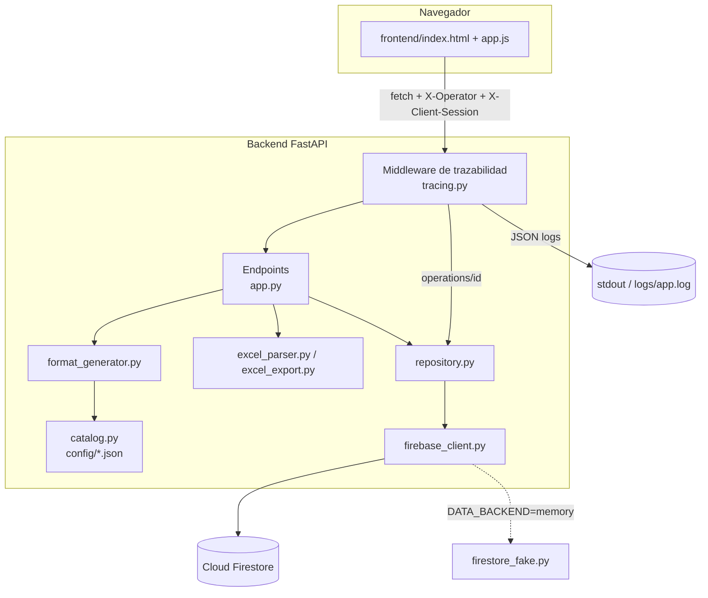
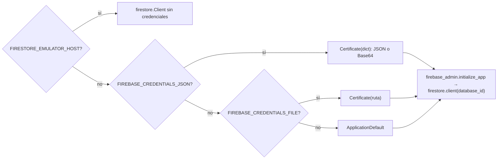
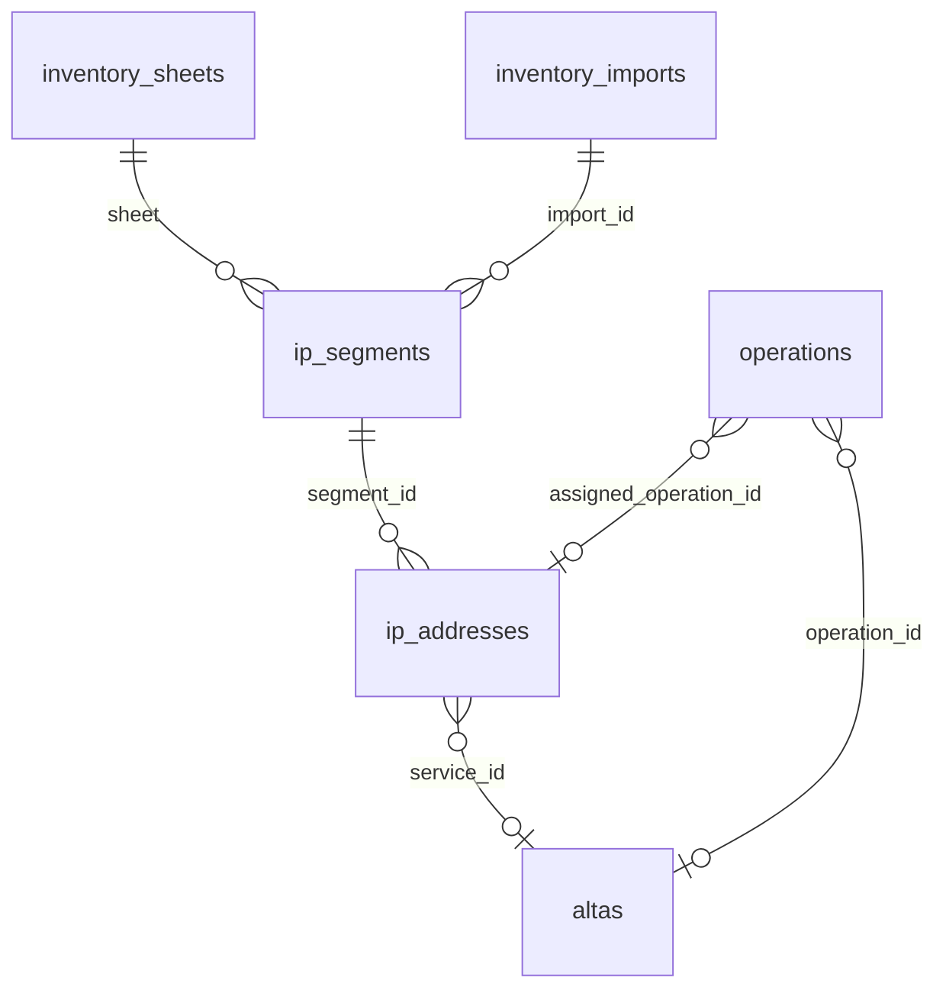
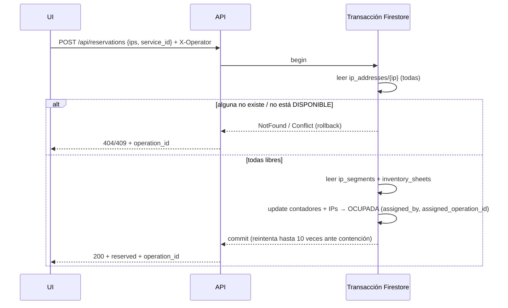
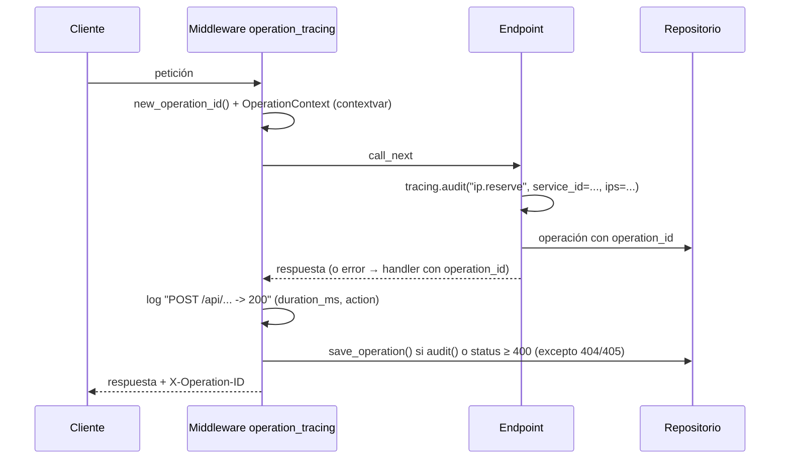

# Manual de desarrollador — Claro CENAM Service Manager

Referencia técnica para mantener y extender la aplicación (v2.0). Para instalar y desplegar vea el [README](../README.md).

---

## Contenido

1. [Visión general](#1-visión-general)
2. [Estructura del repositorio](#2-estructura-del-repositorio)
3. [Entorno de desarrollo](#3-entorno-de-desarrollo)
4. [Configuración](#4-configuración)
5. [Modelo de datos en Firestore](#5-modelo-de-datos-en-firestore)
6. [Flujos principales](#6-flujos-principales)
7. [Referencia de la API](#7-referencia-de-la-api)
8. [Trazabilidad y logs](#8-trazabilidad-y-logs)
9. [Plantillas de servicio y catálogo](#9-plantillas-de-servicio-y-catálogo)
10. [Frontend](#10-frontend)
11. [Pruebas y CI](#11-pruebas-y-ci)
12. [Recetas: cómo extender](#12-recetas-cómo-extender)
13. [Limitaciones conocidas y siguientes pasos](#13-limitaciones-conocidas-y-siguientes-pasos)

---

## 1. Visión general



Principios de diseño:

* **Firestore es la única fuente de verdad.** El Excel es solo formato de entrada/salida.
* **Las reservas son transacciones** (`reserve`, `release`): sin bloqueos en memoria, así se puede escalar a varios workers o instancias.
* **Un solo repositorio de datos** (`InventoryRepository`) habla la API de `google-cloud-firestore`. En pruebas se le inyecta un cliente en memoria con la misma interfaz (`backend/db/firestore_fake.py`); la compatibilidad con el SDK real se prueba contra el emulador (`tests/integration`).
* **Toda petición tiene un `operation_id`**, que viaja en logs, respuestas, documentos y la interfaz.

---

## 2. Estructura del repositorio

```
backend/                    Paquete Python (FastAPI). Entrada: backend.main:app
  __init__.py               __version__
  main.py                   create_app(): lifespan, middleware, errores, routers y frontend estático
  api/                      Capa HTTP (sin lógica de negocio)
    dependencies.py         AppState, build_state(), StateDep/OperatorDep, helpers de validación
    middleware.py           ID de operación por petición y auditoría en `operations`
    errors.py               Errores -> JSON con operation_id
    routes/                 Un router por dominio: system, inventory, network, reservations, altas, operations
  schemas/requests.py       Modelos Pydantic de entrada
  core/                     settings.py (variables de entorno), tracing.py (logs/IDs), errors.py (errores de dominio)
  db/                       firebase_client.py (cliente real/emulador/memoria), firestore_fake.py
  repositories/inventory.py Acceso a Firestore: inventario, reservas, altas, VLANs, loopbacks, operaciones, centrales
  services/                 Lógica sin HTTP: catalog, format_generator, excel_parser, excel_import, excel_export
config/                     service_templates.json (plantillas, medios, pool de loopbacks), centrales.json
frontend/                   index.html, app.js, style.css (sin build, JS nativo)
firebase/                   firestore.rules, firestore.indexes.json (firebase.json en la raíz apunta aquí)
scripts/                    CLI: import_excel, seed_centrales, create_sample_excel
tests/                      unit/ (sin HTTP), api/ (TestClient en memoria), integration/ (emulador)
data/                       Excel de ejemplo
docs/                       Manuales e imágenes
AGENTS.md                   Contexto para agentes de IA (CLAUDE.md lo importa)
Dockerfile, .env.example, requirements*.txt, pyproject.toml, iniciar_programa.sh/.bat
```

**Dónde va cada cambio:** un endpoint nuevo va en el router de su dominio (o en un módulo nuevo de `api/routes/` registrado en `routes/__init__.py`); la lógica, en `services/`; el acceso a Firestore, en `repositories/`; los modelos de entrada, en `schemas/`.

---

## 3. Entorno de desarrollo

```bash
python -m venv .venv && source .venv/bin/activate      # Windows: .venv\Scripts\activate
pip install -r requirements-dev.txt
cp .env.example .env                                    # ajustar
```

**Modo memoria (sin credenciales).** Carga automáticamente `data/ejemplo_inventario_ips.xlsx`:

```bash
DATA_BACKEND=memory LOG_FORMAT=text python -m uvicorn backend.main:app --reload
```

**Emulador de Firestore** (requiere Java 11+ y `npm i -g firebase-tools`):

```bash
firebase emulators:start --only firestore --project demo-claro-admin
# en otra terminal
FIRESTORE_EMULATOR_HOST=127.0.0.1:8085 FIREBASE_PROJECT_ID=demo-claro-admin \
  python -m uvicorn backend.main:app --reload
python -m scripts.import_excel data/ejemplo_inventario_ips.xlsx --operator "Dev"
```

**Documentación interactiva de la API:** `http://127.0.0.1:8000/docs` (Swagger) y `/redoc`.

---

## 4. Configuración

`backend/core/settings.py` define la clase `Settings` (pydantic-settings). Cada atributo corresponde a una variable de entorno en mayúsculas (`data_backend` → `DATA_BACKEND`). También lee `.env`. `get_settings()` está cacheado; en pruebas se llama `get_settings.cache_clear()`.

Resolución de credenciales en `firebase_client.create_firestore_handle`:



`FirestoreHandle` agrupa el cliente y las piezas que difieren entre SDK real y memoria: `transactional`, `descending`, `field_filter`.

---

## 5. Modelo de datos en Firestore

Todas las colecciones llevan el prefijo `FIRESTORE_COLLECTION_PREFIX`.



### `inventory_sheets/{red_base}` — p. ej. `10.20.38.0`

| Campo | Tipo | Nota |
|---|---|---|
| `sheet` | string | Red base /24 |
| `segments_count`, `available_count`, `assigned_count`, `gateway_count` | int | Contadores (se ajustan en cada transacción) |
| `last_import_id` | string | `IMP-...` |
| `updated_at` | timestamp | |

### `ip_segments/{red}_{cidr}` — p. ej. `10.20.38.0_27`

`segment_id`, `sheet`, `network_ip` (`10.20.38.0/27`), `network_octet`, `broadcast_ip`, `broadcast_octet`, `gateway_ip`, `gateway_octet`, `cidr`, `size`, `vlan`, `vlan_raw`, `available_count`, `assigned_count`, `import_id`, `updated_at`.

### `ip_addresses/{ip}` — p. ej. `10.20.38.6`

| Campo | Nota |
|---|---|
| `ip`, `octet`, `sheet`, `segment_id` | Ubicación |
| `status` | `DISPONIBLE` · `OCUPADA` · `GATEWAY` |
| `service_id`, `purpose` | Servicio y uso (`WAN`, `LAN`, `ADICIONAL`) |
| `assigned_by`, `assigned_at`, `assigned_operation_id` | Trazabilidad de la reserva (`importación excel` si vino del archivo) |
| `released_by`, `released_at`, `released_operation_id`, `released_service_id`, `release_reason` | Última liberación |
| `import_id`, `updated_at` | |

Red y broadcast no se guardan como documentos (no son asignables).

### `inventory_imports/{IMP-AAAAMMDD-XXXXXXXX}`

Resumen de `ImportResult` + `filename`, `operator`, `operation_id`, `created_at`, `conflicts` (máx. 200).

### `altas/{ALTA-AAAAMMDD-XXXXXXXX}`

`alta_id`, `service_id`, `cliente`, `tipo_servicio`, `ip_wan`, `red_wan`, `isla`, `vlan`, `loopback`, `operator`, `operation_id`, `formatted_text`, `form_data` (payload del formulario **sin `psk`**), `content_hash` (SHA-256 del texto), `created_at`.

### `alta_hashes/{sha256}`

`alta_id`, `created_at`. Se crea en la misma transacción que el alta para que dos registros simultáneos del mismo texto produzcan una sola alta.

### `operations/{OP-AAAAMMDD-XXXXXXXXXXXX}`

`operation_id`, `action`, `method`, `path`, `status_code`, `outcome` (`ok`/`error`), `operator`, `client_session`, `client_ip`, `duration_ms`, `service_id`, `details` (mapa), `error`, `created_at`, `expires_at` (TTL).

### `centrales/{id}`

`id`, `nombre`, `isla`, `demo`, `equipos[]` (`no, rol, marca, modelo, hostname, ip_admon`; `int_in`/`int_out` se aceptan pero ya no se imprimen en la ruta), `updated_at`.

### `vlans/{ISLA}_{vlan}`

`isla`, `vlan`, `rd`, `vrf_name`, `vrf_desc`, `vlan_desc`, `updated_by`, `updated_operation_id`, `updated_at`. Se escribe con `PUT /api/vlans` o al registrar un alta que traiga esos datos (un campo vacío no borra lo guardado).

### `loopbacks/{ip}`

`ip`, `service_id`, `assigned_by`, `assigned_operation_id`, `assigned_at`. `POST /api/altas` con `loopback_auto: true` asigna en una transacción la primera IP libre del pool (o reutiliza la del servicio). `GET /api/loopbacks/next` y la vista previa solo la consultan.

### Isla en `inventory_sheets` e `ip_segments`

Campo `isla` (mayúsculas). Se fija al importar (`isla` en el formulario; vacío conserva la anterior) o con `PUT /api/sheets/{red}/isla`. `GET /api/islas` y `GET /api/segments?isla=` alimentan los selectores de Equipamiento (`isla=` vacío = segmentos sin isla).

### Índices

Definidos en `firebase/firestore.indexes.json`: `altas (service_id ASC, created_at DESC)`, `operations (operator ASC, created_at DESC)`, `operations (service_id ASC, created_at DESC)`; TTL en `operations.expires_at`; exclusión de índices para `altas.formatted_text` y `altas.form_data` (campos grandes).

---

## 6. Flujos principales

### 6.1 Importación de Excel (`POST /api/inventory/import`)

1. Validaciones: extensión `.xlsx`, firma ZIP (`PK`), tamaño ≤ `MAX_UPLOAD_MB`; `replace` requiere `confirm_replace=true`.
2. `parse_inventory_excel` → `ExcelIPAMReader.parse_sheet` por cada hoja cuyo nombre es una IPv4; las demás se reportan en `ignored_sheets`.
   Los nombres de hoja se normalizan (`normalize_sheet_name`): deben ser una IPv4 terminada en `.0`; dos hojas que normalizan al mismo segmento se rechazan.
3. `InventoryRepository.import_inventory`, por hoja:
   * Construye segmentos e IPs del Excel; rechaza subredes duplicadas o rangos superpuestos.
   * Lee lo existente (`where sheet == X`).
   * **merge:**
     * Si Firestore tiene la IP `OCUPADA` y el Excel dice otra cosa → se conserva Firestore y se agrega a `conflicts`. Documentos idénticos no se reescriben (`ips_unchanged`).
     * Las IPs se escriben con `_guarded_ip_writes`: transacciones de 150 IPs que **vuelven a leer** cada documento y solo escriben si `status`/`service_id` siguen como en la lectura inicial. Si alguien reservó la IP mientras tanto, se reporta como conflicto *“modificada durante la importación”* y no se pisa.
     * Si el Excel subdivide un rango (p. ej. un /28 pasa a dos /29), las subredes viejas superpuestas se eliminan, y las IPs libres que quedaron como red/broadcast también; las ocupadas se conservan y se reportan.
   * **replace:** operación de mantenimiento; elimina IPs y segmentos de la hoja que no estén en el Excel y escribe todo en lotes de 450 (`_commit_in_batches`, límite de Firestore: 500).
   * `_recompute_counters` recalcula los contadores de subredes y hoja **dentro de una transacción** leyendo el estado real (consultas con `stream(transaction=...)`).

> El modo *replace* no es atómico entre lotes: si falla a mitad, repítalo (es idempotente) y evite usarlo mientras otros reservan IPs.

### 6.2 Reserva (`POST /api/reservations`)



* Todas las lecturas ocurren antes de las escrituras (requisito de Firestore).
* Atómica: o se reservan todas las IPs de la solicitud o ninguna (máx. 64).
* `release` es simétrica y además exige que `service_id` coincida.

### 6.3 Alta

* `POST /api/generate-format` → solo vista previa, no persiste.
* `POST /api/altas` → genera el texto, calcula `content_hash` y, en una transacción, busca `alta_hashes/{hash}`: si existe devuelve esa alta con `duplicate: true`; si no, crea `altas/{ALTA-...}` y el documento del hash.

---

## 7. Referencia de la API

Encabezados de petición:

| Encabezado | Uso |
|---|---|
| `X-Operator` | Nombre del operador (URL-encoded). **Obligatorio en escrituras**; si falta → 400 |
| `X-Client-Session` | ID aleatorio por pestaña del navegador (correlación) |

Toda respuesta incluye `X-Operation-ID`. Los errores tienen la forma `{"detail": "...", "code": "...", "operation_id": "OP-..."}`.

| Método | Ruta | Descripción | Audita |
|---|---|---|---|
| GET | `/api/health` | Salud + ping a Firestore | — |
| GET | `/api/status` | Versión, backend, totales del inventario | — |
| GET | `/api/config` | Plantillas, valores por defecto, centrales | — |
| GET | `/api/sheets` | Segmentos /24 con contadores | — |
| GET | `/api/blocks?sheet=10.20.38.0` | Subredes con IPs libres y ocupadas | — |
| POST | `/api/inventory/import` | multipart: `file`, `mode` (`merge`/`replace`), `confirm_replace` | `inventory.import` |
| GET | `/api/inventory/export` | Descarga `.xlsx` | `inventory.export` |
| POST | `/api/reservations` | `{ips[], service_id, purpose}` | `ip.reserve` |
| POST | `/api/reservations/release` | `{ips[], service_id, reason}` | `ip.release` |
| GET | `/api/services/{service_id}` | IPs y altas del servicio | — |
| POST | `/api/generate-format` | `{data}` → vista previa | — |
| POST | `/api/altas` | `{data}` → genera y registra | `alta.create` |
| GET | `/api/altas?service_id=&limit=` | Historial | — |
| GET | `/api/altas/{alta_id}` | Alta completa | — |
| GET | `/api/operations/{operation_id}` | Detalle de una operación | — |
| GET | `/api/operations?operator=&service_id=&limit=` | Búsqueda de operaciones | — |
| POST | `/api/centrales/sync` | Copia `config/centrales.json` a Firestore | `centrales.sync` |

Ejemplos:

```bash
curl -s -X POST localhost:8000/api/reservations \
  -H 'Content-Type: application/json' -H 'X-Operator: Ana%20L%C3%B3pez' \
  -d '{"ips":["10.20.38.6"],"service_id":"GT-IC-000123"}' -i | grep -i x-operation-id

curl -s -X POST localhost:8000/api/inventory/import -H 'X-Operator: Ana' \
  -F file=@inventario.xlsx -F mode=merge

curl -s localhost:8000/api/operations/OP-20261004-17A162B15627 | jq
```

---

## 8. Trazabilidad y logs

### 8.1 Ciclo de vida de una operación



* `tracing.new_operation_id()` → `OP-{AAAAMMDD}-{secrets.token_hex(6).upper()}` (48 bits aleatorios por día).
* `OperationContext` vive en un `ContextVar`; `ContextFilter` lo inyecta en cada `LogRecord` (`operation_id`, `operator`), incluso en endpoints síncronos que FastAPI ejecuta en hilos.
* `tracing.audit(action, **details)` marca la operación para persistirla y agrega detalles. Llámela al inicio del endpoint (para que un error también quede con su acción) y otra vez al final con los resultados.
* La persistencia de la operación nunca rompe la respuesta: si falla, se registra un `logger.exception`.
* Las excepciones no controladas se capturan **dentro** del middleware (no en `ServerErrorMiddleware`, que corre fuera de él), así la respuesta 500 conserva el `operation_id` y el encabezado. En `operations.error` se guarda solo `internal_error`; la traza completa queda únicamente en el log.
* `clean_text` elimina caracteres de control del operador y textos libres (evita inyección de líneas en logs).

### 8.2 Formato de log

`LOG_FORMAT=json` (por defecto): una línea JSON por evento con `ts`, `level`, `severity`, `logger`, `operation_id`, `operator`, `message` y los campos de `extra=`. Ejemplo de uso:

```python
logger.info("IPs reservadas", extra={"ips": req.ips, "service_id": req.service_id})
```

`LOG_FORMAT=text` es más legible en desarrollo:

```
2026-10-04 16:55:37,910 INFO    [OP-20261004-17A162B15627] [Samuel Castillo] claro.api: IPs reservadas
```

Destinos: stdout siempre; `LOG_DIR/app.log` con rotación (`LOG_FILE_MAX_MB`, `LOG_FILE_BACKUPS`) si `LOG_DIR` no está vacío. El access log de Uvicorn se desactiva porque el middleware registra cada petición con su ID.

---

## 9. Plantillas de servicio y catálogo

`config/service_templates.json`:

```json
"DATOS": {
  "label": "DATOS", "linea1": "DATOS", "prefijo_linea2": "DATOS", "banner": "DATOS",
  "item_principal": "DATOS LOCAL {velocidad}",
  "items_adicionales": ["ARRENDAMIENTO EQUIPO", "MONITOREO ENLACE"],
  "vrf_name": "", "vrf_desc": "", "rd": "",
  "import_policy": "", "export_policy": "", "apply_label_per_instance": true,
  "traffic_policy": "", "vpn_targets": [], "pendiente_validar": true
}
```

Reglas del generador (`format_generator.generate_format_text`):

* Si el formulario envía un campo (aunque esté vacío), **manda el formulario**; la plantilla solo se usa si el campo no viene (`None`).
* Si `vrf_name` queda vacío, se **omite** el bloque `ip vpn-instance`.
* `export_policy` admite `{vrf_name}`; `vpn_targets` acepta `"6458:1 export-extcommunity"` o la línea completa `vpn-target ...`.
* `pendiente_validar: true` muestra un aviso en la interfaz.
* `network_defaults` alimenta gestor Raisecom, equipo CPE, tramo de enlace (`FO`) e ID de loopback.

Los archivos se validan con Pydantic al iniciar (`catalog.load_catalog`); un JSON inválido impide el arranque con un mensaje claro.

---

## 10. Frontend

* Sin framework ni build: `frontend/app.js` en JS moderno, servido por FastAPI (`StaticFiles`).
* `api(path, opts)` centraliza `fetch`: agrega `X-Operator` y `X-Client-Session`, lee `X-Operation-ID`, actualiza **Última operación** y lanza `ApiError(message, operationId, status)`.
* `toast(msg, type, operationId)` muestra notificaciones con el ID copiable; `confirmDialog()` sustituye `confirm()`.
* `el(tag, attrs, ...children)` construye DOM sin `innerHTML` (evita XSS con datos del inventario).
* `localStorage` solo guarda el nombre del operador, envuelto en `try/catch`.
* Copiar/descargar solo se habilitan con un alta registrada (`state.registeredAlta`); cualquier edición posterior la invalida (`markFormatStale`).

---

## 11. Pruebas y CI

```bash
python -m pytest            # 52 pruebas (+2 del emulador, que se omiten sin FIRESTORE_EMULATOR_HOST)
ruff check backend scripts tests
```

| Archivo | Cubre |
|---|---|
| `tests/api/test_api.py` | Endpoints: reservas atómicas y concurrentes, liberación, importación merge/replace/conflictos, exportación ida y vuelta, altas idempotentes, auditoría, logs con ID |
| `tests/unit/test_units.py` | Plantillas por servicio, campos de medio, parser (gateway, etiquetas), settings y credenciales, prefijo de colecciones, formato JSON de log, unicidad de IDs |
| `tests/unit/test_parser_y_formato.py` | Parser y generador con el Excel de ejemplo |
| `tests/api/test_regresiones.py` | Hallazgos de la revisión de código: nombres de hoja, parámetros inválidos, error 500 con ID, gateway vs. IP asignada, exportación sin fórmulas, re-subdivisión, escrituras protegidas, PSK, altas concurrentes |
| `tests/integration/test_firestore_emulator.py` | Repositorio con el **SDK real** contra el emulador (consultas, lotes, transacciones, doble reserva) |

`conftest.py` fuerza `DATA_BACKEND=memory` y crea un `TestClient` limpio por prueba.

**CI:** el repositorio todavía no tiene un workflow de GitHub Actions. Hasta que se agregue, ejecute localmente `ruff check backend scripts tests` y `python -m pytest` antes de cada push (y `tests/integration` con el emulador cuando toque el repositorio).

---

## 12. Recetas: cómo extender

**Agregar un endpoint auditado**

```python
@app.post("/api/algo")
def hacer_algo(req: AlgoRequest, state: StateDep, operator: OperatorDep) -> dict[str, Any]:
    tracing.audit("algo.hacer", service_id=req.service_id)        # 1) marcar la acción
    resultado = state.repo.hacer_algo(req, operator, tracing.current_operation_id())
    logger.info("Algo hecho", extra={"id": resultado["id"]})      # 2) log con contexto
    return {"resultado": resultado, "operation_id": tracing.current_operation_id()}
```

* Use `OperatorDep` en toda escritura.
* Lance `InventoryError`, `NotFoundError` o `ConflictError` desde el repositorio: el manejador global responde con el código HTTP correcto y el `operation_id`.
* Si agrega consultas con `where` + `order_by` sobre campos distintos, agregue el índice a `firebase/firestore.indexes.json`.
* Si usa una operación nueva del SDK, impleméntela también en `backend/db/firestore_fake.py` y cúbrala en `tests/integration/test_firestore_emulator.py`.

**Agregar un tipo de servicio:** agregue una entrada en `config/service_templates.json` (aparece sola en el selector) y una prueba en `tests/unit/test_units.py`.

**Cambiar el formato del alta:** edite `backend/services/format_generator.py` y actualice las aserciones de `tests/unit/test_parser_y_formato.py` / `tests/unit/test_units.py`.

---

## 13. Limitaciones conocidas y siguientes pasos

* **Autenticación:** el operador es declarativo. Siguiente paso natural: Firebase Authentication o IAP; el middleware ya centraliza el operador, bastaría con tomarlo de un token verificado.
* **Plantilla DATOS:** pendiente de los valores reales de Ingeniería (`pendiente_validar`); los datos reales se guardan por VLAN en `vlans`.
* **Loopbacks:** no se liberan automáticamente al dar de baja un servicio; hoy se libera borrando el documento `loopbacks/{ip}`.
* **Catálogo de centrales:** `config/centrales.json` contiene datos de demostración.
* **Importación no atómica** entre lotes de 450 escrituras (idempotente; repetir si falla).
* **Sin pruebas automatizadas del frontend** en CI (se validó con Playwright de forma manual; ver capturas en `docs/img`).
* Las búsquedas por servicio son por coincidencia exacta del ID.
