# Manual de usuario — Claro CENAM Service Manager

Guía ilustrada para ingenieros que reservan IPs y generan formatos de alta.
Versión de la aplicación: **2.0**.

> Las capturas se tomaron con datos de demostración. Los nombres, IPs y equipos que verá en su ambiente serán los reales.

---

## Contenido

1. [¿Qué hace la aplicación?](#1-qué-hace-la-aplicación)
2. [Primer ingreso: su nombre de operador](#2-primer-ingreso-su-nombre-de-operador)
3. [Partes de la pantalla](#3-partes-de-la-pantalla)
4. [Paso a paso: generar un alta](#4-paso-a-paso-generar-un-alta)
5. [Liberar una IP](#5-liberar-una-ip)
6. [Importar el inventario desde Excel](#6-importar-el-inventario-desde-excel)
7. [Exportar el inventario](#7-exportar-el-inventario)
8. [Consultas e historial](#8-consultas-e-historial)
9. [Cómo pedir soporte: el ID de operación](#9-cómo-pedir-soporte-el-id-de-operación)
10. [Mensajes frecuentes](#10-mensajes-frecuentes)

---

## 1. ¿Qué hace la aplicación?

* Muestra el **inventario de IPs** guardado en Firebase, organizado por segmento /24 y subred (VLAN).
* Permite **reservar** una o varias IPs libres para un ID de servicio, y **liberarlas** cuando el servicio se da de baja.
* Arma el **formato de alta** (INTERNET o DATOS corporativo) con la factibilidad, la ruta de equipos y los recursos asignados.
* **Registra** cada alta en Firebase para consultarla después.
* Deja **constancia de quién hizo qué y cuándo**: cada acción tiene un **ID de operación** que puede compartir con soporte.

Varias personas pueden usarla a la vez: si dos intentan reservar la misma IP, solo una lo logra y la otra recibe un aviso.

---

## 2. Primer ingreso: su nombre de operador

La primera vez que abre la aplicación en un navegador, se le pide su **nombre y apellido**. Se guarda en ese navegador y se registra en cada reserva, liberación, importación y alta.

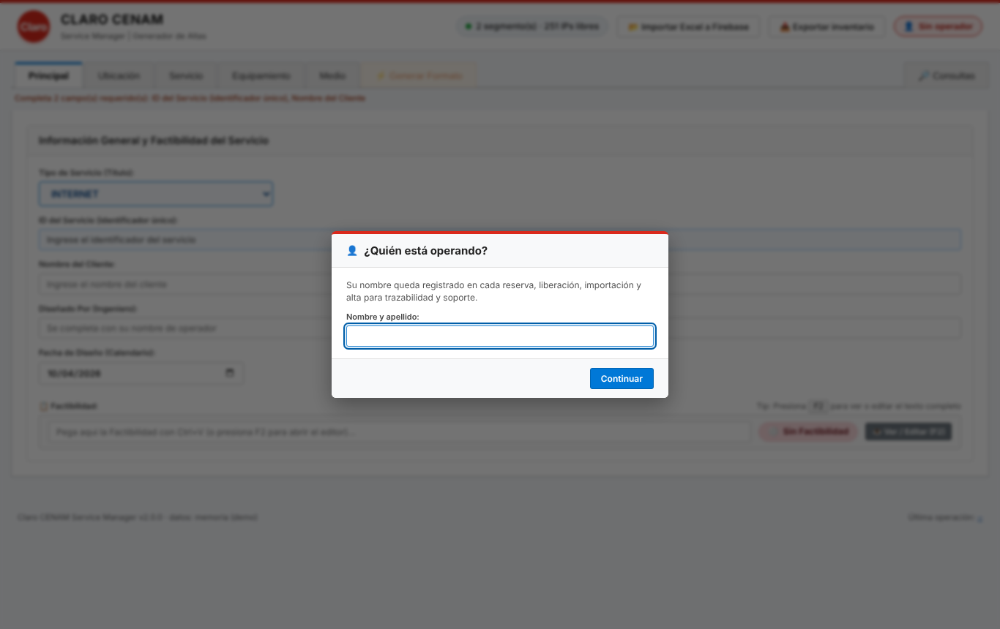

* Para cambiarlo, haga clic en el botón con su nombre (👤) en la esquina superior derecha.
* Si el botón aparece en rojo con el texto *Sin operador*, no podrá hacer cambios hasta ingresar su nombre.
* Su nombre también se usa para completar el campo **Diseñado por**.

---

## 3. Partes de la pantalla

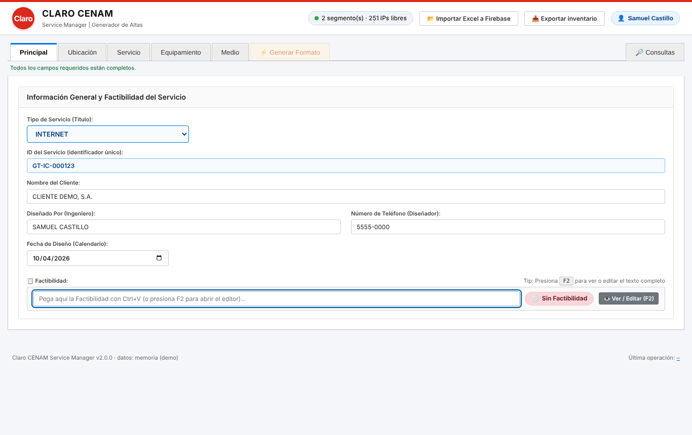

| Zona | Para qué sirve |
|---|---|
| **Indicador verde** (cabecera) | Cantidad de segmentos e IPs libres en Firebase. En amarillo: inventario vacío. En rojo: no hay conexión. |
| **Importar Excel a Firebase** | Carga o actualiza el inventario a partir de un Excel ([sección 6](#6-importar-el-inventario-desde-excel)). |
| **Exportar inventario** | Descarga el inventario actual en Excel ([sección 7](#7-exportar-el-inventario)). |
| **👤 Nombre** | Operador actual; clic para cambiarlo. |
| **Pestañas** | Principal → Servicio → Equipamiento → Medio → Generar Formato. **Consultas** está a la derecha. Las pestañas de captura se habilitan cuando la factibilidad está cargada o se marcó **Sin factibilidad**. |
| **Línea de estado** | Indica qué campos obligatorios faltan. La pestaña *Generar Formato* se habilita cuando están completos. |
| **Pie de página** | Versión y **Última operación** (clic para copiar el ID). |

---

## 4. Paso a paso: generar un alta

### 4.1 Pestaña Principal

1. **ID del Servicio** y **Nombre del Cliente**: obligatorios.
2. **Diseñado por**, teléfono y fecha.
3. **Factibilidad:** pegue el texto completo con **Ctrl+V** en el recuadro. Si el texto trae `TITULO: ***...***`, el tipo de servicio se ajusta solo. Presione **F2** (desde cualquier campo) para ver o editar el texto ya cargado.
   * Si el servicio no tiene factibilidad, pulse **🚫 Sin factibilidad**. El alta mostrará `SIN FACTIBILIDAD`.
   * Mientras no haga una de las dos cosas, **no podrá pasar a las demás pestañas**.

> La antigua pestaña *Ubicación* se eliminó: la dirección viene dentro del texto de factibilidad.

### 4.2 Pestaña Servicio

Medio de transmisión (**FIBRA ÓPTICA**, **RADIOENLACE** o **G-PON**), equipo CPE extremo cliente y observaciones opcionales. El medio aparece en la ruta (`FO`, `RADIO` o `G-PON`).

### 4.3 Pestaña Equipamiento: isla, VLAN e IPs

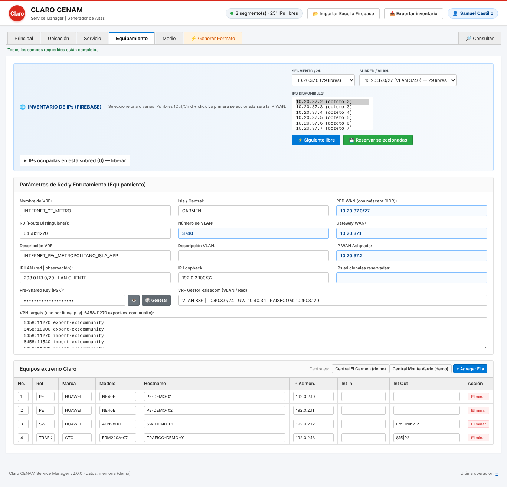

> Las capturas de esta sección son de la versión anterior; el orden de los campos cambió como se describe abajo.

1. **Isla / Central** (primera opción). Al elegirla se carga la ruta de equipos de su central y solo se ofrecen los segmentos de esa isla.
   * Los segmentos importados antes de esta versión aparecen en *(Segmentos sin isla asignada)*. Selecciónelos y pulse **🏷 Isla** junto al segmento para asignarlos; también puede indicar la isla al importar el Excel.
2. **Tipo de servicio** (segunda opción): **INTERNET** o **DATOS**. Solo INTERNET habilita el campo **IP Pública**.
3. **Número de VLAN** (tercera opción). Limita los segmentos /24, las subredes y las IPs disponibles a esa VLAN, y completa **RD**, **Nombre de VRF**, **Descripción VRF** y **Descripción VLAN** con lo guardado para la VLAN.
   * Si la VLAN aún no tiene datos, escríbalos y pulse **💾 Guardar datos de la VLAN** (también se guardan al registrar el alta). La próxima vez se completarán solos.
4. Elija el **Segmento /24** y la **Subred**; en **IPs Disponibles** seleccione una o varias IPs (mantenga **Ctrl** o **Cmd**). La **primera** será la **IP WAN**. **Siguiente libre** selecciona la primera IP libre.
5. Pulse **Reservar seleccionadas** y confirme. Verá un mensaje verde con el **ID de operación**.

   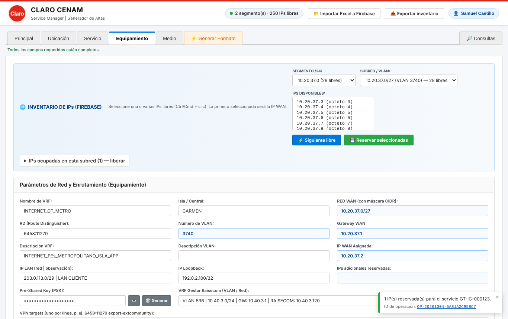

> **Importante:** las IPs quedan reservadas en Firebase al confirmar, aunque todavía no registre el alta. Si se equivocó, libérelas ([sección 5](#5-liberar-una-ip)).

**IP LAN (Loopback):** marque **¿Se necesita loopback?** y el sistema asigna la siguiente /32 libre del rango `10.212.100.1` a `10.212.100.254`. Se reserva al **registrar** el alta; un mismo servicio conserva siempre su loopback. Con loopback, el alta termina con el bloque *FAVOR DE AGREGAR LOOPBACK AL MONITOREO EN NMIS E ISE* (reemplaza al antiguo campo PSK).

**Equipos extremo Claro:** se cargan al elegir la isla, o con el botón de la central. Puede editar cada celda, **Agregar fila** o **Eliminar**. En la ruta se encadenan en el orden de la columna **No.** (desde el 1) con el formato `Rol Marca Modelo Hostname (IP Admon.) -->`.

### 4.4 Pestaña Medio

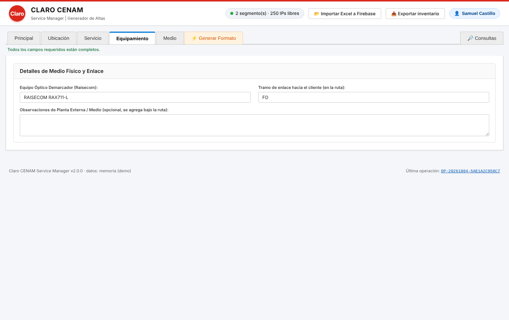

* **Equipo demarcador** (Raisecom): aparece como `(CLIENTE) RAISECOM ...` en la línea de **RUTA A CONFIGURAR**. El tramo del medio sale de la pestaña Servicio.
* **Observaciones de medio**: si escribe algo, se agrega debajo de la ruta.

### 4.5 Pestaña Generar Formato: vista previa y registro

Al abrir la pestaña se muestra una **vista previa** (aún no registrada):

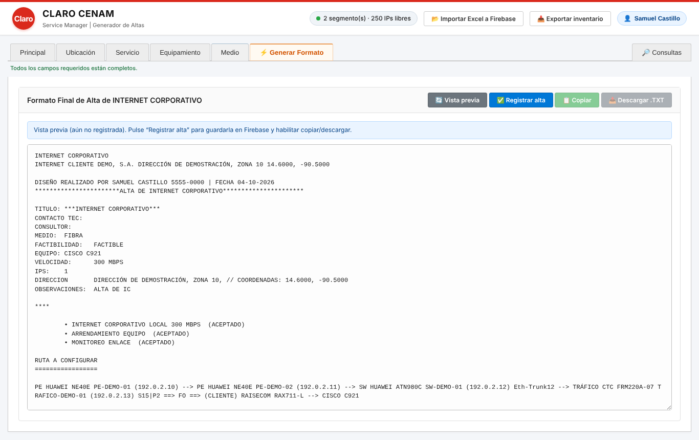

* **Vista previa** vuelve a generar el texto con los datos actuales, sin guardarlo.
* El formato **imprime únicamente los datos que se llenaron**: si un campo está vacío, su línea no aparece.
* **Registrar alta** guarda el formato en Firebase y le asigna un número **ALTA-AAAAMMDD-XXXXXXXX**. Si la IP WAN no está reservada para ese servicio, se le pedirá confirmación.

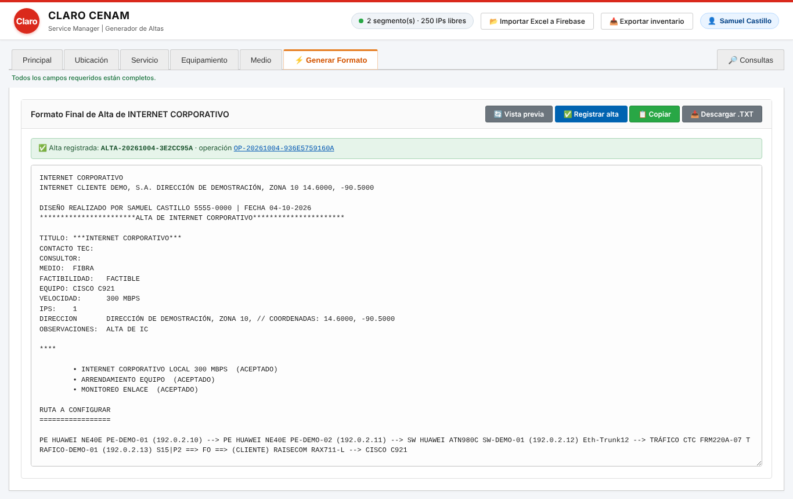

* **Copiar** y **Descargar .TXT** se habilitan solo después de registrar, para que todo formato entregado quede registrado.
* Si modifica cualquier dato después de registrar, verá el aviso amarillo *“Hay cambios sin registrar”*: vuelva a pulsar **Registrar alta** para guardar la nueva versión.
* Registrar dos veces exactamente el mismo texto no crea duplicados: se le muestra el alta existente.

---

## 5. Liberar una IP

1. En **Equipamiento**, seleccione la subred y despliegue **IPs ocupadas en esta subred — liberar**.

   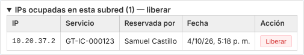

2. Pulse **Liberar** en la fila, escriba el **motivo** y confirme.

   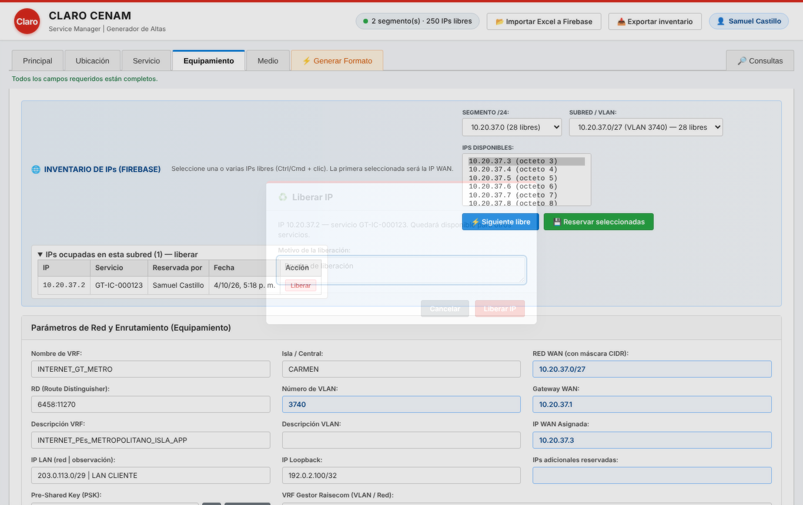

La IP vuelve a quedar disponible. El motivo, su nombre y el ID de operación quedan registrados.

---

## 6. Importar el inventario desde Excel

Use **Importar Excel a Firebase** en la cabecera.

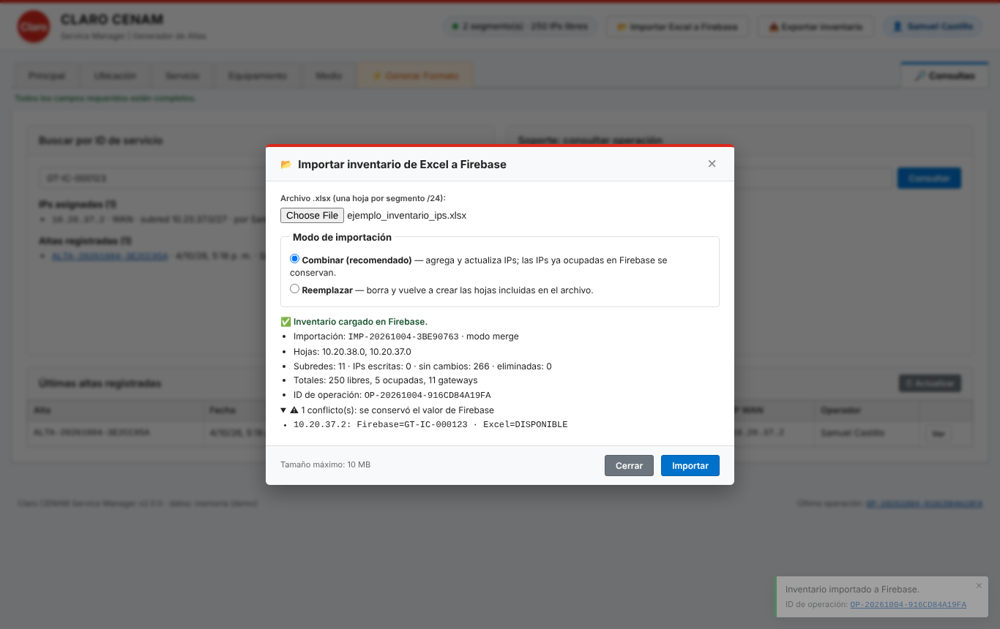

**Formato del Excel**

* Una hoja por segmento /24. El **nombre de la hoja** es la red base, por ejemplo `10.20.38.0`. Las hojas con otro nombre se ignoran y se informan en el resumen.
* Columnas en pares: **octeto | etiqueta**.
* Fila de red con la VLAN (ej. `INTERNET 3740`), gateway rotulado `GW`, cierre del bloque con `BROADCAST`.
* Etiqueta vacía o `-` = IP libre. Cualquier otro texto = ID de servicio ocupado.

**Modos**

| Modo | Qué hace | Cuándo usarlo |
|---|---|---|
| **Combinar** (recomendado) | Agrega subredes e IPs nuevas y actualiza las libres. **Las IPs ya ocupadas en Firebase se conservan**; si el Excel dice otra cosa, se reporta como conflicto. | Actualizaciones periódicas |
| **Reemplazar** | Borra y vuelve a crear las hojas incluidas en el archivo (las demás no se tocan). Requiere marcar la confirmación. | Primera carga o corrección masiva |

Al terminar verá el **ID de importación**, el **ID de operación**, los totales y la lista de conflictos.

---

## 7. Exportar el inventario

**Exportar inventario** descarga `inventario_ips_AAAAMMDD_HHMM.xlsx` con el mismo formato de importación: libres en blanco, ocupadas con su ID de servicio, `GW` y `BROADCAST`. Sirve como respaldo o para compartir; puede volver a importarse sin pérdidas.

---

## 8. Consultas e historial

Pestaña **🔎 Consultas**:

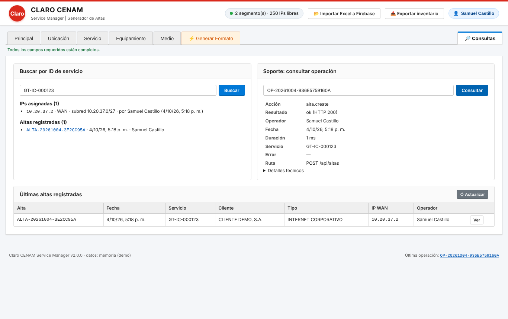

* **Buscar por ID de servicio:** IPs asignadas (con quién y cuándo) y altas registradas.
* **Soporte: consultar operación:** pegue un ID `OP-...` para ver qué se hizo, quién, cuándo, el resultado y el error, si lo hubo.
* **Últimas altas registradas:** botón **Ver** para abrir el texto completo y copiarlo.

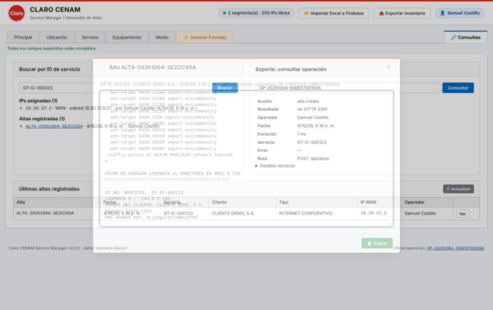

---

## 9. Cómo pedir soporte: el ID de operación

Cada acción muestra un **ID de operación** con el formato `OP-20261004-55D1CEC75558`, también cuando hay un error:

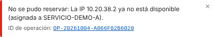

Cuando algo falle:

1. Haga clic sobre el ID (en el mensaje o en **Última operación** al pie de la página) para **copiarlo**.
2. Envíelo a soporte junto con una breve descripción de lo que intentaba hacer.

Con ese ID, soporte encuentra exactamente su operación en los registros, sin necesidad de capturas de pantalla.

---

## 10. Mensajes frecuentes

| Mensaje | Qué significa | Qué hacer |
|---|---|---|
| *Indique su nombre de operador antes de realizar cambios* | No hay operador definido | Haga clic en 👤 e ingrese su nombre |
| *La IP … ya no está disponible (asignada a …)* | Otra persona la reservó antes | Elija otra IP (la lista se actualiza sola) |
| *La IP … pertenece al servicio X, no a Y* | Intentó liberar con un servicio distinto | Verifique el ID de servicio |
| *Hay cambios sin registrar* | Editó datos después de registrar | Pulse **Registrar alta** otra vez |
| *La IP WAN … no figura reservada* | Va a registrar un alta con una IP sin reservar | Reserve la IP primero, o confirme si es intencional |
| *Confirme el reemplazo…* | Eligió el modo Reemplazar sin marcar la casilla | Marque la confirmación o use Combinar |
| *Error al conectar con Firebase* (indicador rojo) | El servidor no llega a Firebase | Reporte el ID de operación a soporte |
| *Error interno. Comparta el ID de operación…* | Falla inesperada | Copie el ID y repórtelo |

**Atajos de teclado:** **F2** abre o cierra el editor de factibilidad. **Esc** cierra la ventana abierta.
